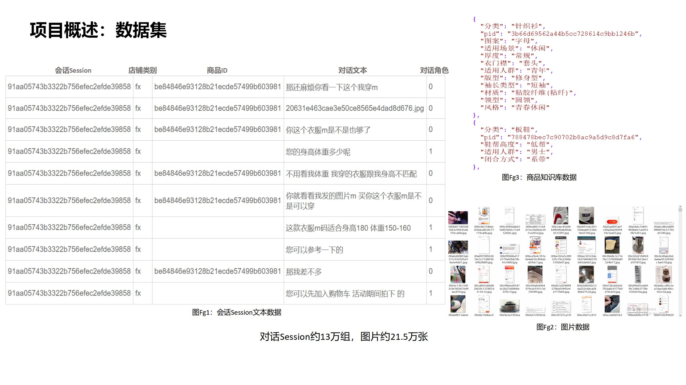
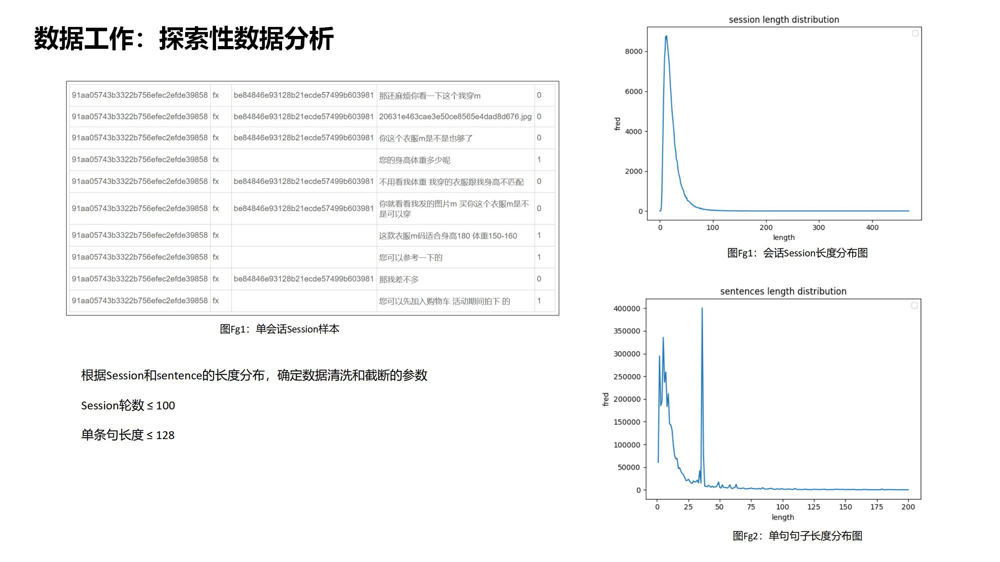
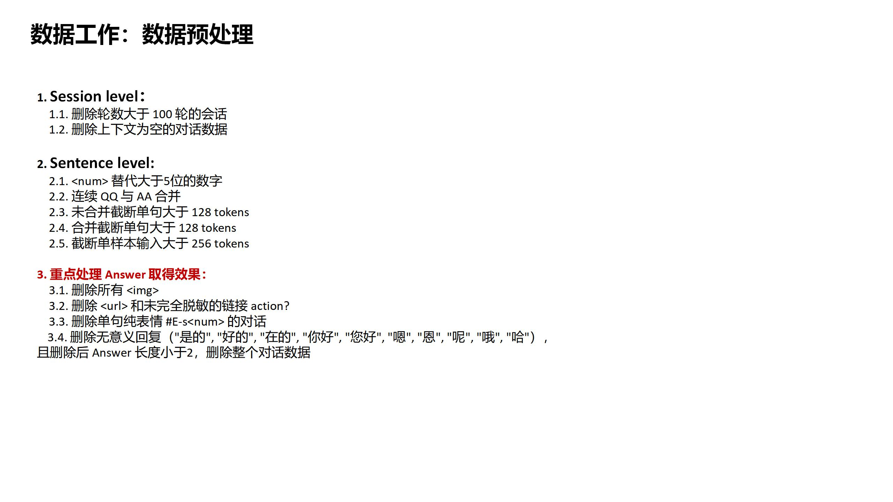
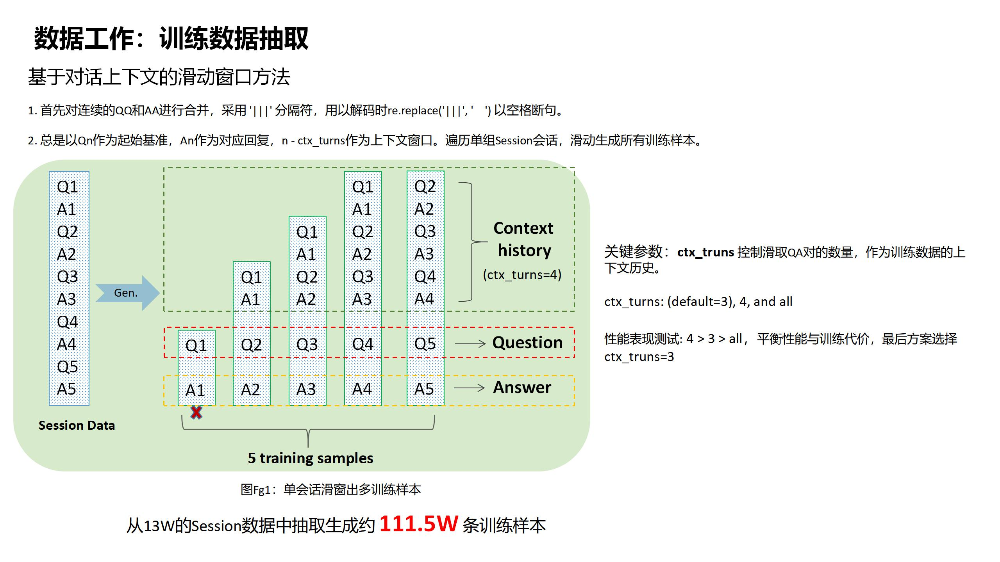
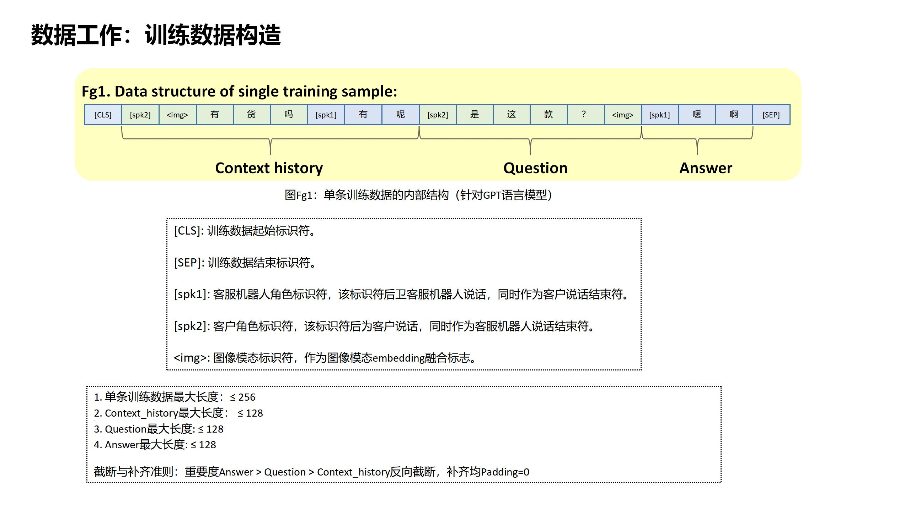
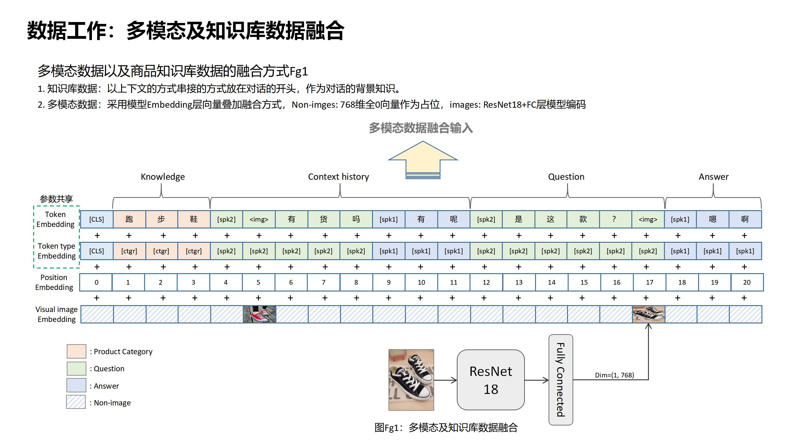
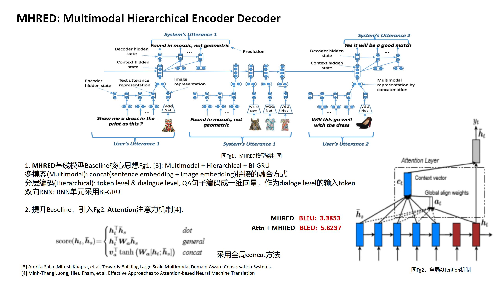
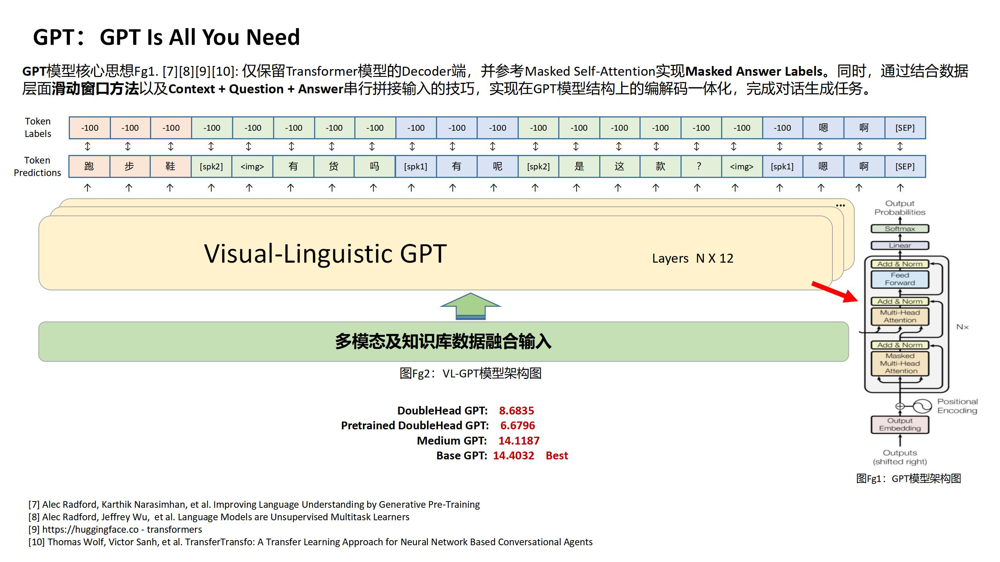

# 2020京东多模态对话JDMDC2020第二名解决方案

[JDMDC2020官网：http://jddc.jd.com/](http://jddc.jd.com)

Hibot团队成绩：初赛第三，决赛第二

## 数据工作

### 数据集探索

数据分为五个字段：会话ID, 店铺类别， 商品ID， 对话文本（包含图片ID）， 对话角色。通过商品ID与图片ID，来引用商品知识库数据和图片模态数据。

统计原始会话（连续QQAA未合并）轮数长度以及单句文本长度（按字）。

### 数据预处理

### 训练数据构造

### 融合多模态与知识库

## 技术方案

### 基线模型MHRED

官方提供基线生成模型MHRED：https://github.com/jd-aig/nlp_baai/tree/master/jddc2020_baseline/mhred/pytorch

基线模型MHRED复现BLEU分为：3.3853，在基线的基础上，我们加入了注意力机制BLEU提分到：5.6237。

### 最佳模型VLGPT

## 总结与引用

**What did work**

1. 去除上下文为空的数据

2. 去除无意义回复，例如好的，嗯嗯，哦... 

3. 根据数据集自定义字典，OOV问题

4. 带掩码的Loss，masked answer labels

5. 增加token type embedding区分角色

6.  Base基础GPT模型

7. 各种注意力机制Self-Attention, Context-Attention, Masked SeLf-Attention[5][12] 

**What didn't work**

1. 删除通用模板回复

2. Label Smoothing提升微弱 [13]

3. 多头任务学习DoubleHead GPT(生成任务+是否为下一句) [14]

4. BERT中文wiki预训练模型 [15]

5. GPT中文wiki[16]与清华开源预训练模型 [17][18]

6. Medium中型GPT模型

7. 最大互信息Maximum Mutual Information(MMI) [19]

[1] Kishore Papineni, Salim Roukos, et al. BLEU: a Method for Automatic Evaluation of Machine Translation 

[2] Boxing Chen, Colin Cherry et al. A Systematic Comparison of Smoothing Techniques for Sentence-Level BLEU

[3] Amrita Saha, Mitesh Khapra, et al. Towards Building Large Scale Multimodal Domain-Aware Conversation Systems

[4] Minh-Thang Luong, Hieu Pham, et al. Effective Approaches to Attention-based Neural Machine Translation

[5] Ashish Vaswani, Noam Shazeer,  et al. Attention Is All You Need

[6] Jacob Devlin, Ming-Wei Chang, et al. BERT: Pre-training of Deep Bidirectional Transformers for Language Understanding

[7] Alec Radford, Karthik Narasimhan, et al. Improving Language Understanding by Generative Pre-Training 

[8] Alec Radford, Jeffrey Wu,  et al. Language Models are Unsupervised Multitask Learners 

[9] https://huggingface.co - transformers

[10] Thomas Wolf, Victor Sanh, et al. TransferTransfo: A Transfer Learning Approach for Neural Network Based Conversational Agents

[11] https://github.com/huggingface/transfer-learning-conv-ai

[12] https://jalammar.github.io/illustrated-transformer

[13] Rafael Müller, Simon Kornblith, st al. when does label smoothing help?

[14] https://huggingface.co/transformers/model_doc/gpt2.html#gpt2doubleheadsmodel

[15] https://huggingface.co/bert-base-chinese

[16] https://github.com/qingkongzhiqian/GPT2-Summary

[17] https://cloud.tsinghua.edu.cn/f/4dfb8c6c22ae47fbbe98

[18] Yida Wang, Pei Ke, et al. A Large-Scale Chinese Short-Text Conversation Dataset

[19] Yizhe Zhang, Siqi Sun,  et al. DialoGPT:Large-Scale Generative Pre-training for Conversational Response Generation